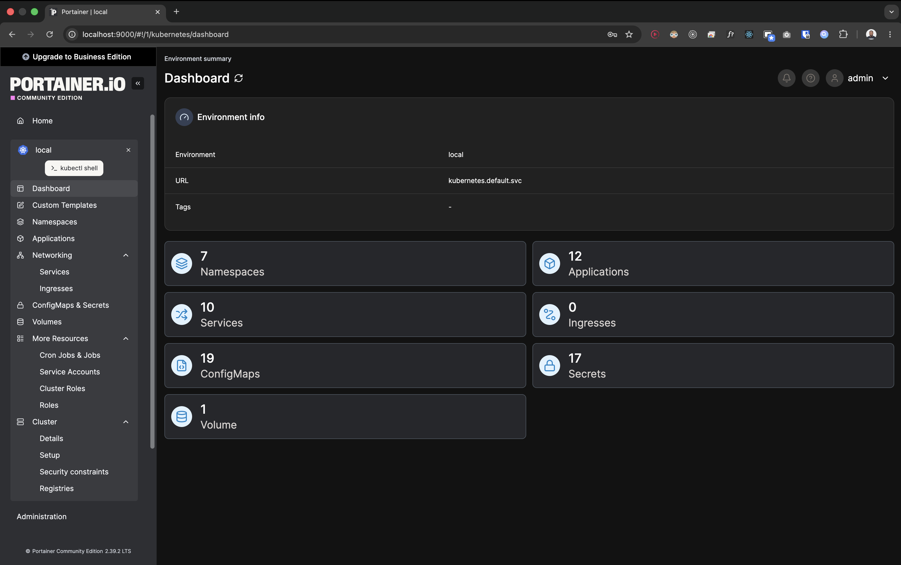

# Local Portainer Setup for Kind Kubernetes Cluster

This project uses **Portainer Community Edition** as a local Kubernetes dashboard for inspecting the Kind cluster during development.

Portainer is not required for the application to run, but it gives a visual way to inspect:

- Namespaces
- Pods
- Deployments
- Services
- Events
- Helm-managed workloads
- Kubernetes resources inside the local cluster



## Why Portainer?

While `kubectl` remains the main tool for debugging, Portainer is useful for quickly visualizing what is running inside the local Kind cluster.

In this project, Portainer helps inspect resources such as:

- `task-dashboard`
- `task-gateway`
- `task-validator`
- `task-enricher`
- Strimzi Kafka resources
- Kafka UI
- Services and pod status

## Prerequisites

Make sure the local Kind cluster is already running:

```bash
kind get clusters
```

Expected:

```text
ent-aws-capstone-local
```

Also make sure your current Kubernetes context points to the Kind cluster:

```bash
kubectl config current-context
```

Expected:

```text
kind-ent-aws-capstone-local
```

## Add the Portainer Helm Repository

```bash
helm repo add portainer https://portainer.github.io/k8s/
helm repo update
```

## Install Portainer

For local Kind usage, install Portainer with HTTP access and a `ClusterIP` service.

```bash
helm upgrade --install portainer portainer/portainer \
  --namespace portainer \
  --create-namespace \
  --set enterpriseEdition.enabled=false \
  --set image.repository=portainer/portainer-ce \
  --set image.tag=lts \
  --set tls.force=false \
  --set service.type=ClusterIP
```

## Verify Installation

Check the namespace:

```bash
kubectl get ns
```

Expected:

```text
portainer   Active
```

Check the Portainer pod:

```bash
kubectl get pods -n portainer
```

Expected:

```text
portainer-xxxxx   1/1   Running
```

Check the service:

```bash
kubectl get svc -n portainer
```

Expected:

```text
portainer   ClusterIP   ...   9000/TCP
```

## Access Portainer Locally

Port-forward the Portainer service:

```bash
kubectl port-forward -n portainer svc/portainer 9000:9000
```

Open in the browser:

```text
http://localhost:9000
```

## First-Time Setup

When Portainer opens:

1. Create the admin user.
2. Choose **Get Started**.
3. Select the local Kubernetes environment.

This connects Portainer to the Kind cluster where it is running.

## Important Timeout Note

For security, a new Portainer installation may time out if the admin user is not created quickly.

If you see this message:

```text
Your Portainer instance timed out for security purposes.
To re-enable your Portainer instance, you will need to restart Portainer.
```

Restart the deployment:

```bash
kubectl rollout restart deployment/portainer -n portainer
```

Then port-forward again:

```bash
kubectl port-forward -n portainer svc/portainer 9000:9000
```

Open again:

```text
http://localhost:9000
```

Create the admin user immediately.

## Troubleshooting

### Pod stuck at `0/1 Running`

Check events:

```bash
kubectl describe pod -n portainer -l app.kubernetes.io/name=portainer
```

Check logs:

```bash
kubectl logs -n portainer deploy/portainer
```

### Portainer installed with forced TLS by mistake

If Portainer was installed with:

```bash
--set tls.force=true
```

the health probes may fail because Kubernetes checks HTTP on port `9000`.

For local Kind, reinstall with:

```bash
--set tls.force=false
```

If needed, remove the broken install:

```bash
helm uninstall portainer -n portainer
kubectl delete namespace portainer
```

Then reinstall using the local setup command above.

## Uninstall Portainer

```bash
helm uninstall portainer -n portainer
kubectl delete namespace portainer
```

## Recommended Usage

Use Portainer as a visual dashboard, but keep using `kubectl` for serious debugging.

Useful commands:

```bash
kubectl get pods -A
kubectl get svc -A
kubectl describe pod <pod-name> -n <namespace>
kubectl logs -n <namespace> deploy/<deployment-name>
```

Portainer is mainly for visibility. `kubectl` remains the source of truth for debugging.
